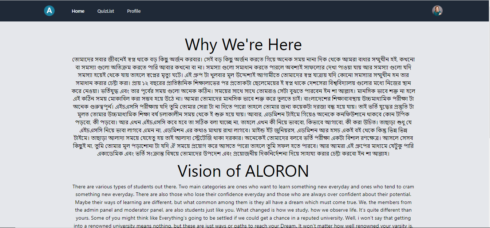
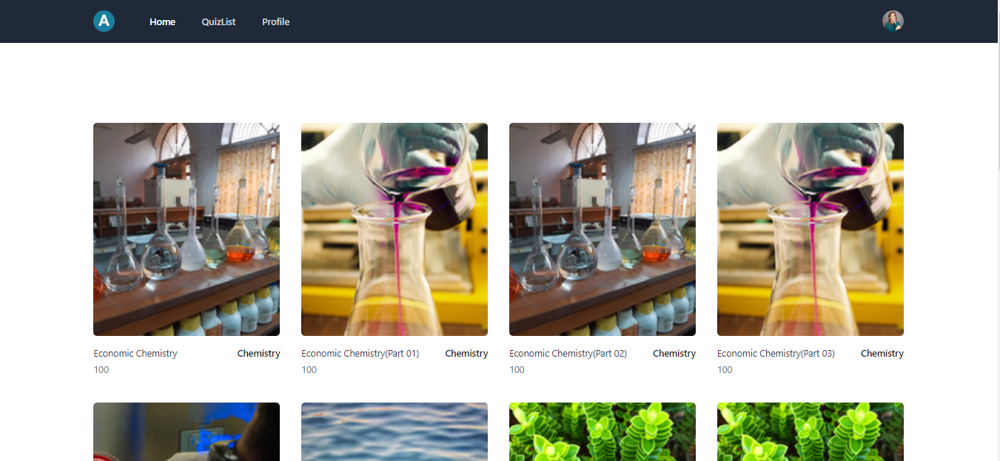
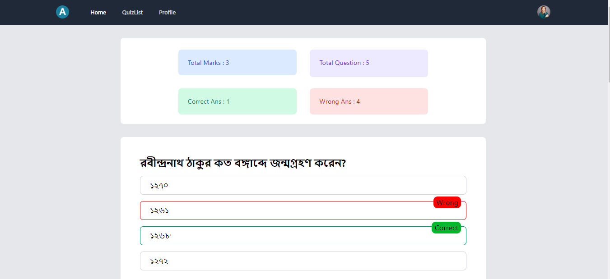
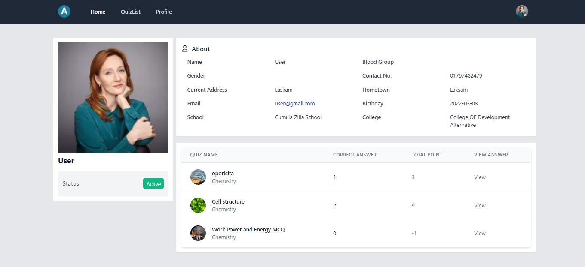
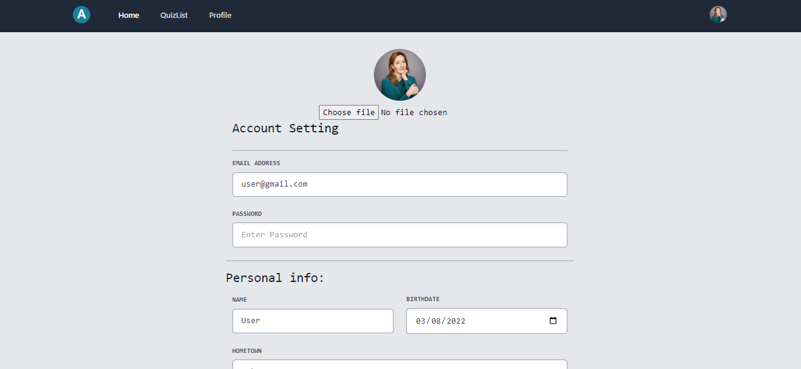

 # AloronBD

It is Complete Quiz Project. 

## Installation

Just clone this , and run 

```bash
npm start
```


## Features

- Quiz Timer
- Question/Options Soring 
- Once click answer can't remove
- Student Dashboard, can check result and answer
- Student profile Settings


## Screenshot

Here Are Some Screenshot/Demo 

## Homepage



## Quiz Page



## Quiz Results 




## User Profile


 
## User Settings


## Related

 

[Admin Panel React](https://github.com/raihanmiraj/aloronbd-admin)
 

[Admin Panel Backend](https://github.com/raihanmiraj/aloronbdapi)

